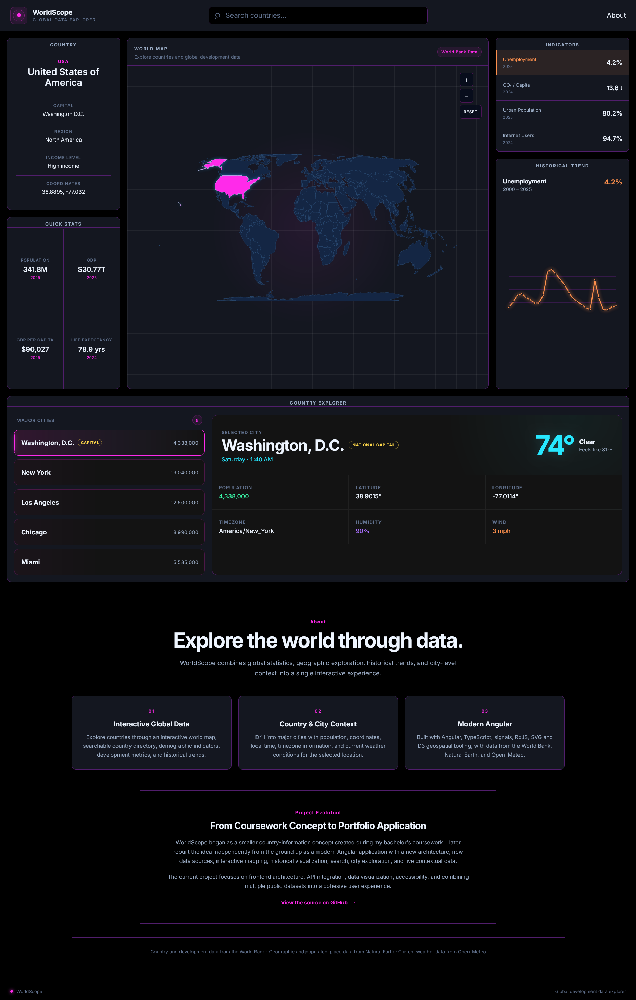
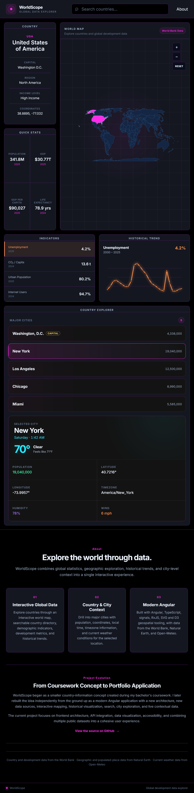
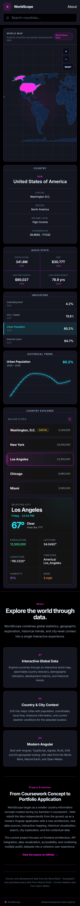
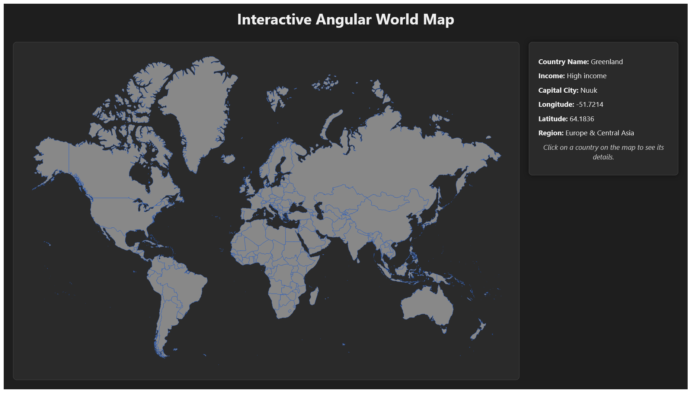

# WorldScope

An interactive global data explorer built with Angular, TypeScript, D3, and public data APIs.

WorldScope turns global data into an interactive exploration experience. Users can navigate a world map, search for countries, examine demographic and development indicators, visualize historical trends, and drill down into major cities for local time and current weather conditions.

This project is a ground-up evolution of a much smaller concept I originally built during my bachelor's coursework. The current implementation was independently redesigned and rebuilt as a portfolio application with a new architecture, expanded functionality, new data sources, and a completely new interface.

---

## Preview



---

## Features

### Interactive World Map

- Interactive SVG world map built from Natural Earth geographic data
- Equal Earth geographic projection using D3
- Country selection through mouse and keyboard interaction
- Hover, focus, and selected-country states
- Scroll-to-zoom and drag-to-pan navigation
- Dedicated zoom-in, zoom-out, and reset controls
- Country selection synchronized with the rest of the dashboard

### Country Search

- Search countries by name
- Live filtered results
- Country and region context
- Keyboard navigation with Arrow Up and Arrow Down
- Enter to select
- Escape to close results
- Accessible combobox and listbox behavior
- Search selections synchronize with map selections

### Country Overview

Selected countries display contextual information including:

- Country name
- Capital
- Geographic region
- Income classification
- Country identifiers

### Quick Statistics

WorldScope retrieves current country statistics from the World Bank, including:

- Population
- Gross domestic product
- GDP per capita
- Life expectancy

### Development Indicators

Additional development indicators include:

- Unemployment
- CO₂ emissions per capita
- Urban population
- Internet usage

### Historical Trends

Development indicators can be explored over time through an interactive SVG line chart.

The chart includes:

- Historical observations from the World Bank
- Indicator-specific colors
- Interactive data points
- Hover and keyboard focus states
- Accessible value labels
- Dynamic loading, error, and insufficient-data states

### Country Explorer

The Country Explorer extends WorldScope beyond country-level statistics by providing local context for major cities.

For each supported country, WorldScope selects up to five significant cities from Natural Earth's populated-places dataset. National capitals are prioritized, with the remaining locations selected by population.

City information includes:

- Population
- Capital status
- Latitude and longitude
- IANA timezone
- Current local weekday and time
- Current temperature
- Apparent temperature
- Weather conditions
- Humidity
- Wind speed

Changing the selected city automatically updates its local context and current weather.

---

## Responsive Design

WorldScope adapts its data-dense interface across desktop, tablet, and mobile layouts while preserving the same exploration workflow.

<table>
  <tr>
    <td width="65%">
      
    </td>
    <td width="35%">
      
    </td>
  </tr>
  <tr>
    <td align="center"><strong>Tablet</strong></td>
    <td align="center"><strong>Mobile</strong></td>
  </tr>
</table>

On larger screens, the application presents country context, the world map, indicators, and historical trends as a unified dashboard. At narrower widths, those same tools reorganize into tablet and mobile layouts without removing functionality.

---

## Data Sources

WorldScope combines multiple public geographic and statistical data sources.

### World Bank

The World Bank API provides country metadata, current statistics, development indicators, and historical observations.

Indicators currently used include:

| Indicator | World Bank Code |
| --- | --- |
| Population | `SP.POP.TOTL` |
| GDP | `NY.GDP.MKTP.CD` |
| GDP per capita | `NY.GDP.PCAP.CD` |
| Life expectancy | `SP.DYN.LE00.IN` |
| Unemployment | `SL.UEM.TOTL.ZS` |
| CO₂ emissions per capita | `EN.GHG.CO2.PC.CE.AR5` |
| Urban population | `SP.URB.TOTL.IN.ZS` |
| Internet users | `IT.NET.USER.ZS` |

### Natural Earth

Natural Earth provides the geographic datasets used for:

- Country boundaries
- Populated places
- City coordinates
- Population estimates
- Capital identification
- Timezone metadata

The application uses Natural Earth 1:110m Admin 0 Countries data for the world map and 1:10m Populated Places data to generate the Country Explorer city dataset.

The full populated-places dataset is not shipped directly with the application. A development-time generation script reduces the source data into a small curated dataset containing up to five cities per country.

### Open-Meteo

Open-Meteo provides current weather conditions for selected cities using their geographic coordinates.

Current weather data includes:

- Temperature
- Apparent temperature
- Weather condition
- Relative humidity
- Wind speed

No API key is required by the application.

---

## City Data Generation

WorldScope generates its application-ready city dataset from Natural Earth's 1:10m Populated Places dataset rather than maintaining city information manually.

The generation process:

1. Reads Natural Earth populated-place records.
2. Groups locations by country.
3. Prioritizes national capitals.
4. Sorts remaining cities by population.
5. Selects up to five cities per country.
6. Normalizes known country-code differences between Natural Earth datasets.
7. Generates the TypeScript dataset consumed by the Angular application.

This reduces thousands of Natural Earth populated-place records to a compact dataset appropriate for the application while keeping the selection process reproducible.

The generated dataset currently contains approximately 880 cities across more than 200 Natural Earth country and territory codes.

---

## Technology

| Technology | Purpose |
| --- | --- |
| Angular 22 | Application framework and component architecture |
| TypeScript 6 | Application language and type safety |
| Angular Signals | Reactive UI and application state |
| RxJS | Asynchronous data streams and API operations |
| D3 Geo | Geographic projection and SVG path generation |
| D3 Selection | SVG interaction |
| D3 Zoom | Map zooming and panning |
| SVG | Interactive map and historical trend visualization |
| SCSS | Component and application styling |
| Vitest | Unit and component testing |
| World Bank API | Country statistics and historical indicators |
| Natural Earth | Geographic and populated-place datasets |
| Open-Meteo | Current city weather |

---

## Architecture

WorldScope uses a feature-oriented Angular structure:

```text
src/app/
├── features/
│   ├── about/
│   ├── country-data/
│   ├── country-explorer/
│   ├── map/
│   └── search/
├── app.html
├── app.scss
└── app.ts
```

Feature directories contain their own components, models, services, and supporting data where appropriate.

The root application coordinates shared state such as the currently selected country, while individual components remain focused on presentation or feature-specific behavior.

Angular signals provide reactive application state, while RxJS handles asynchronous API operations.

---

## Country Explorer Data Pipeline

The Country Explorer uses a generated dataset rather than bundling the original Natural Earth shapefile.

The local generation workflow uses GDAL to convert Natural Earth's populated-places shapefile to GeoJSON:

```bash
ogr2ogr \
  -f GeoJSON \
  tmp/natural-earth-cities/populated-places.geojson \
  tmp/natural-earth-cities/ne_10m_populated_places.shp
```

The application dataset can then be generated with:

```bash
node scripts/generate-major-cities.mjs
```

The resulting TypeScript data is written to:

```text
src/app/features/country-explorer/data/major-cities.ts
```

Temporary source data used during generation is not committed to the repository.

---

## Accessibility

Accessibility is treated as part of the application's interaction design rather than as an afterthought.

WorldScope includes:

- Keyboard-accessible country selection
- Keyboard-accessible search results
- Focus-visible interaction states
- Accessible combobox/listbox semantics
- Keyboard-accessible historical chart points
- Descriptive ARIA labels for map interactions
- Semantic buttons for interactive controls
- Non-color-only selected and focus states
- Loading, empty, and error states for asynchronous content

---

## Getting Started

### Prerequisites

- Node.js
- npm

GDAL is only required if regenerating the Natural Earth city dataset.

### Installation

Clone the repository:

```bash
git clone https://github.com/hmw55/worldscope.git
cd worldscope
```

Install dependencies:

```bash
npm install
```

Start the development server:

```bash
npm start
```

Then open:

```text
http://localhost:4200
```

### Production Build

Create a production build with:

```bash
npm run build
```

Build output is written to:

```text
dist/worldscope
```

### Testing

Run the test suite with:

```bash
npm test
```

---

## Project Evolution

WorldScope originated from the general concept of a country-information application I created while completing my bachelor's degree.

The original coursework project was a small Angular application centered around an interactive SVG world map and the World Bank API. Clicking a country displayed a limited set of information, including its name, capital, region, income classification, and geographic coordinates.

### Original Coursework Concept



While the original project accomplished the requirements of the assignment, it had significant limitations as a user-facing application:

- The layout was not responsive.
- On smaller screens, the fixed-size map extended beyond its container and portions of the world became inaccessible.
- The map could not be panned or zoomed, so users had no way to navigate to countries that were clipped from view.
- Selecting a country displayed its information, but the map provided no persistent visual indication of which country was currently selected.
- Country information was limited to a small set of basic metadata.
- There was no country search, historical data visualization, city-level exploration, or broader statistical context.
- The interaction model was primarily designed around desktop mouse input rather than keyboard and accessible interaction patterns.

The portfolio version is not a publication or continuation of that coursework solution. Instead, I returned to the underlying idea and independently rebuilt it from the ground up, treating the limitations of the original project as design and engineering problems to solve.

### WorldScope Today


The rebuilt WorldScope transforms the original map concept into a responsive global data exploration application.

The map was replaced with a new geographic implementation using Natural Earth data and D3. Countries now have distinct hover, keyboard-focus, and persistent selection states, while zooming and panning allow the map to remain navigable across different viewport sizes. Country search provides an additional navigation method independent of the map.

The data experience was also expanded substantially. Instead of displaying only basic country metadata, WorldScope combines current statistics, development indicators, historical trends, and major-city context from multiple public data sources.

Key improvements include:

- Responsive desktop, tablet, and mobile layouts
- D3-based geographic projection, zooming, and panning
- Persistent visual indication of the selected country
- Country search with keyboard navigation
- Expanded World Bank statistics and development indicators
- Interactive historical trend visualization
- Major-city exploration using processed Natural Earth data
- Local time and timezone context
- Current weather integration through Open-Meteo
- Feature-oriented Angular architecture
- Expanded keyboard and screen-reader accessibility
- Explicit loading, empty, error, hover, focus, and selection states

The screenshots above document the evolution of the underlying concept without distributing the original coursework source code.

---

## Design

WorldScope uses a dark analytics-inspired interface designed to keep dense statistical information readable without making the application feel like a traditional spreadsheet or reporting tool.

The interface separates application accent colors from semantic data colors. Magenta is used for primary interaction and selection, while cyan, green, yellow, orange, purple, and pink distinguish different types of data throughout the application.

The visual hierarchy follows progressive exploration:

```text
World → Country → Indicator → Historical Trend
              ↘ Major City → Local Context
```

---

## License

This repository contains the independently developed WorldScope portfolio application.

Third-party datasets and services remain subject to their respective terms and licenses. Natural Earth data is public domain.

---

## Author

**Holland (Mack) Wesley**

Software Engineer

GitHub: [@hmw55](https://github.com/hmw55)